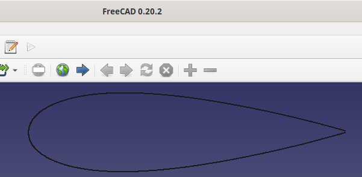

# Airfoil converter
Multipurpose airfoil converter.

## command line tool
Install the command line tool with:

```pip install .```

Once installed, you can use the commands below

### Interpolate an airfoil
```
./airfoil.py --plot --fmt svg --interpolate 1000 airfoils/goe776-il.dat goe776-il-interpolated.svg
```


### Convert airfoils to a format xfoil can interpret
```
./airfoil.py airfoils/goe776-il.dat airfoils-xfoil/goe776-il.dat
```

will convert the -il format file to xfoil's

```
GOE 776 AIRFOIL
       17.       17.

 0.0000000 0.0000000
 0.0125000 0.0395300
...
```

gets converted to a format xfoil can read

```
GOE 776 AIRFOIL
  1.0 0.0052
  0.95 0.01927
  0.9 0.03254
  0.8 0.05678
...
```

### Convert an airfoil to SVG, while interpolating it:
```
./airfoil.py --interpolate 1000 --fmt svg airfoils/goe776-il.dat goe776-il.svg
```


### Convert an airfoil to DXF, while interpolating it:
```
./airfoil.py --interpolate 1000 --fmt dxf airfoils/goe776-il.dat goe776-il.dxf
```


## Web server
There is also a web server app that's handy
run that with

```make docker```
which will build the whole docker image.

Then you can run the thing with

```make run```

which will run it in the foreground